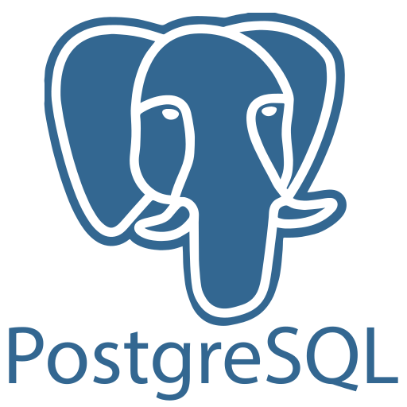

OLA! 👋 Meu nome é Gustavo
==========================

Desenvolvedor de Software
-----------------------------
Desde os meus 21 anos, tenho me dedicado aos estudos e agora estou determinado a me especializar na área de Back-end.

Atualmente, estou cursando Ciência da Computação para aprimorar meu conhecimento e habilidades na área de tecnologia.

* 🌍  Moro no Pará, Brasil 
* ✉️  Você pode me contatar [luizgut2016@gmail.com](mailto:luizgut2016@gmail.com)
* 🚀  Estou estagiando na área de full stack na Logicom Tecnologia!
* 🧠  Atualmente, estou dedicando meu tempo aos estudos de .NET e React!
* ⚡  Amo esportes e meu preferido é Futebol!

### Habilidades:

   
   
   

  

### Colaboracão:
[]

