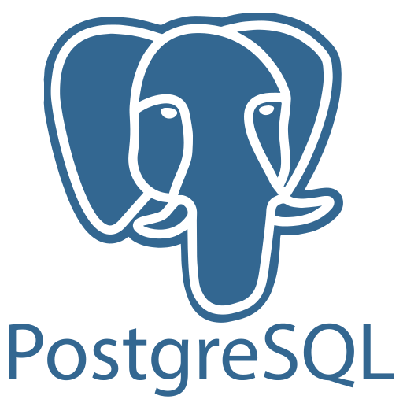

OLA! 👋 Meu nome é Gustavo
==========================

Desenvolvedor Back End
-----------------------------
Desde os meus 17 anos, tenho me dedicado aos estudos e agora estou determinado a me especializar na área de back-end.

Atualmente, estou cursando Ciência da Computação para aprimorar meu conhecimento e habilidades na área de tecnologia.

* 🌍  Moro no Pará, Brasil 
* ✉️  Você pode me contatar [Gustavolino.d3v@gmail.com](mailto:Gustavolino.d3v@gmail.com)
* 🚀  Estou em busca de conhecimentos na área de back-end para aprimorar minhas habilidades e contribuir de forma significativa no desenvolvimento de sistemas e aplicações web.
* 🧠  Atualmente, estou dedicando meu tempo aos estudos de C# e Postgres!
* 🤝  Estou aberto a colaborar em projetos de alto impacto na vida das pessoas
* ⚡  Amo esportes e meu preferido é Futebol!

### Habilidades:

   
   
   
   

  

### Colaboracão:

